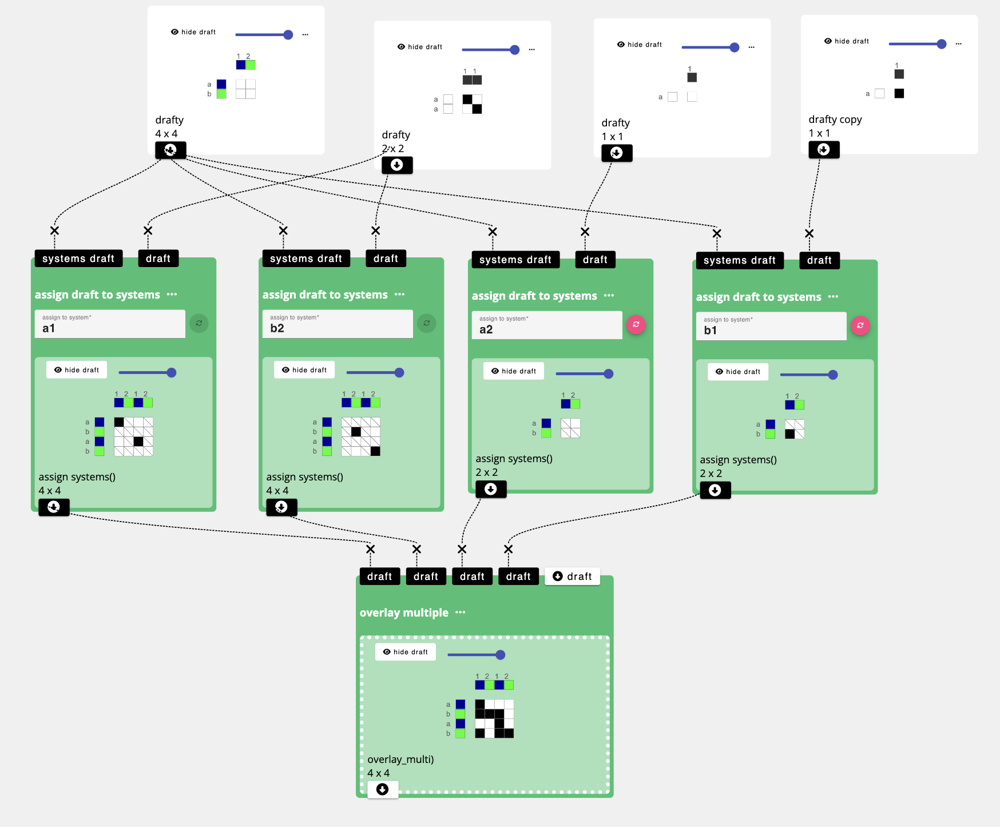

## Parameters
- `assign to system`: a series of letters and numbers, separated by a space, that indicate upon which systems the input draft should be mapped. For example:

    - `a1`: will map the draft connected to the `draft` inlet to regions identified as weft system a and warp system 1 in the `systems draft`. 

    -  `a1b2`: will map the draft connected to the `draft` inlet to regions identified as weft systems a or b and warp systems 1 or 2 in the `systems draft`. 

    - `a`: will map the draft connected to the `draft` to weft system a and include every warp system. 

    - `1`: will map the draft connected to the `draft` to warp system 1 and include every weft system.  

## Inlets

- `systems draft` - the draft connected to this inlet serves as a template for your warp and weft systems. For example, if you want your draft to have two weft systems that alternate (say a and b) and two warp systems that alternate (say 1 and 2), you might create, and then connect, the following draft to this 'systems draft' inlet. This inlet does not look at the drawdown, it only looks at the warp and weft system and materials. 

- `draft` - this draft will be mapped onto the systems specified. 

## Application
This provides a way to assign unique drafts to systems without considering layering. This can be particularly useful if designing compound structures that use different structures to grow different colors into visible and nonvisible regions, without necessarily making them two different layers. 

 Any layering can be done explicitly by the user by assigning the correct raised and lowered systems to the systems draft. Doing so typically requires assigning drafts to every possible combination of warp and weft systems and then using the [`overlay multiple`](overlay_multiple) operation to compose them into a single draft. See below for making a 2-layer draft with system `a1` on the top layer and `b1` on the bottom layer. Tabby is assigned to both layers and a single heddle lift or heddle lower is applied b1 and a2 respectively to ensure that the layers are separated.  

Note how unassigned systems will be filled with unset heddles. You can use the [`set unset`](../transformation/set_unset/) to give all of the unset heddles either a heddle left, or lowered, value.

## Developer
adacad id:` assign systems`
